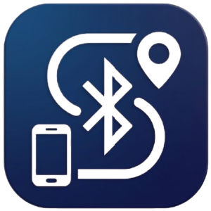
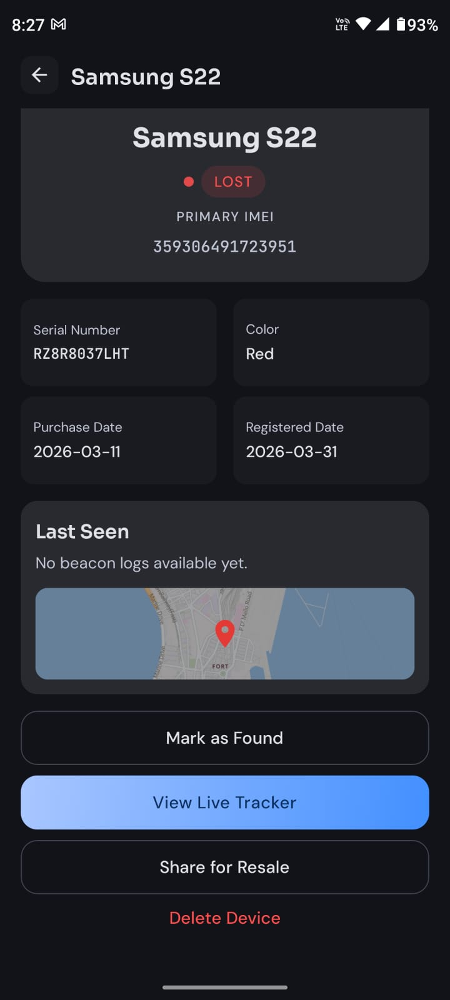
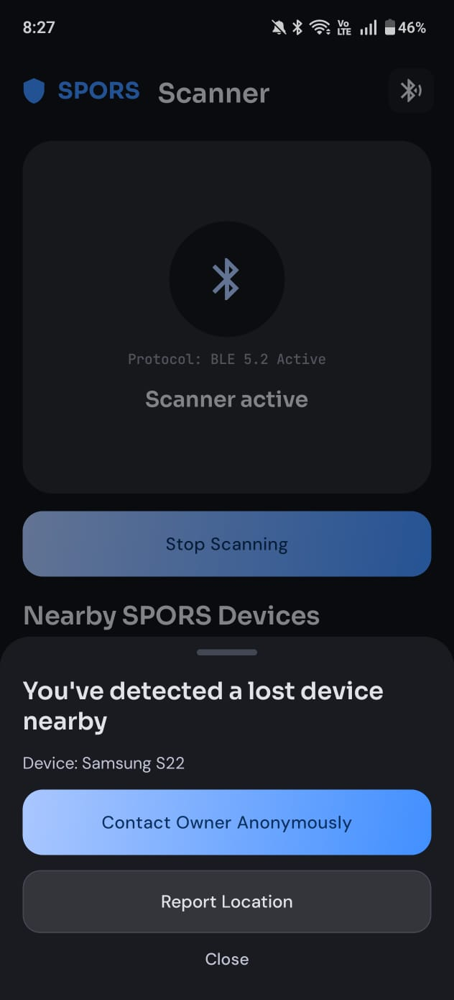

# <div align="center">SPORS: Secure Phone Ownership & Recovery System</div>

<div align="center">
  
</div>

<div align="center">


</div>

<p align="center">
  <b>SPORS</b> is a full-stack device recovery platform built for citizens and law enforcement.
</p>

<p align="center">
It combines:
</p>

- A mobile app (Expo + React Native) for registering phones, reporting lost devices, BLE-based nearby detection, and secure owner-finder chat.
- A web app (Vite + React) for civilian account/device management and a dedicated police operations dashboard.
- A Supabase backend for auth, database, real-time updates, and edge-function automation.

---

## Table of Contents

- [What This Project Solves](#what-this-project-solves)
- [Screenshots](#screenshots)
- [System Overview](#system-overview)
- [Monorepo Structure](#monorepo-structure)
- [Tech Stack](#tech-stack)
- [Feature Overview](#feature-overview)
- [Routing Overview](#routing-overview)
- [Backend and API Design](#backend-and-api-design)
- [Environment Variables](#environment-variables)
- [Local Development](#local-development)
- [Database Setup (Supabase)](#database-setup-supabase)
- [Production Notes](#production-notes)
- [Security Notes for Public Repos](#security-notes-for-public-repos)
- [Troubleshooting](#troubleshooting)

---

## What This Project Solves

> Phone recovery is often fragmented, slow, and difficult to coordinate.

SPORS provides:

- Verified ownership and device registration.
- Lost-device reporting and state management.
- BLE-based nearby detection by other users.
- Privacy-preserving owner-finder communication.
- Police-facing monitoring and investigation tools.

---

## Screenshots

<table>
  <tr>
    <td align="center">
      
      <br />
      <b>Owner View</b>
      <br />
      Lost-device status, metadata, and recovery actions.
    </td>
    <td align="center">
      
      <br />
      <b>Finder View</b>
      <br />
      Nearby detection, anonymous outreach, and location reporting.
    </td>
  </tr>
</table>

---

## System Overview

### High-level flow

1. User signs up and registers a device.
2. Device metadata is stored in Supabase.
3. On insert, backend logic generates SPORS identity keys for BLE tracking.
4. If a phone is reported lost, nearby SPORS clients can detect its BLE signal.
5. Finder can report location and open anonymous chat with owner.
6. Police dashboard aggregates reports, activity, detections, and chat intelligence.

---

## Monorepo Structure

> Refer to the project tree for the exact layout and module boundaries.

---

## Tech Stack

### Mobile App

- Expo SDK 55
- React Native 0.83
- React 19
- Expo Router
- TypeScript
- BLE stack:
  - react-native-ble-plx
  - munim-bluetooth-peripheral
  - expo-task-manager / expo-background-fetch / expo-location

### Web App

- Vite 5
- React 18
- React Router v6
- TypeScript

### Backend

- Supabase Auth
- Supabase Postgres (RLS enabled)
- Supabase Realtime
- Supabase Edge Functions

### External APIs

- LocationIQ (maps/geocoding integration)
- Groq API (chat analysis in police workflows)

---

## Feature Overview

### Civilian (Mobile + Web)

- Sign up / sign in.
- Device registration with IMEI + serial metadata.
- Device status transitions: registered, lost, found, recovered, stolen.
- Report lost incidents and track updates.
- Real-time notifications and chat.
- Finder chat workflow for secure coordination.

### Finder Workflow (Mobile)

- BLE scanning for nearby SPORS beacons.
- Match scanned beacon to lost device records.
- Report current location to owner.
- Open anonymous chat room tied to device and owner.

### Police Workflow (Web)

- Police command dashboard with aggregate metrics.
- Search devices/reports/chats.
- Review active chats and reports.
- Analytics view for operational insight.
- Optional AI-assisted chat risk analysis.

### Important Backend Logic

- Trigger: auto-create profile on auth signup.
- RPC function: verify_imei for ownership/status checks.
- Device key pipeline:
  - Device insert triggers webhook enqueue.
  - Edge Function generate-device-key computes and stores key material.

### Real-time Usage

- Chat room messages live updates.
- Device/beacon updates in tracking views.
- Notification updates for owner workflows.

---

## Routing Overview

> Routing is split between the Expo mobile app and the Vite web app, with flows centered around account access, device management, finder actions, and police operations.

---

## Backend and API Design

> Backend behavior is powered by Supabase auth, database policies, real-time messaging, triggers, RPC functions, and edge functions for device identity workflows.

---

## Environment Variables

> Configure root and web environment files before local development.

---

## Local Development

### Prerequisites

- Node.js 18+
- npm 9+
- Expo CLI (via npx)
- Android Studio / emulator (for Android mobile testing)
- Supabase project configured

### 1) Install dependencies

Root/mobile:

```bash
npm install
```

Web app:

```bash
cd web
npm install
cd ..
```

### 2) Configure environment

Create and fill:

- .env (from .env.example)
- web/.env

### 3) Run apps

Mobile (Expo dev server):

```bash
npm run start
```

Android build/run:

```bash
npm run android
```

Expo web preview (mobile app rendered on web):

```bash
npm run web
```

Web app (Vite):

```bash
cd web
npm run dev
```

Web production build:

```bash
cd web
npm run build
```

---

## Database Setup (Supabase)

> Ensure the Supabase project, schema, policies, and related automations are configured before testing recovery flows end to end.

---

## Production Notes

- Enforce strict RLS for all data paths.
- Use service-role keys only in secure server-side contexts.
- Validate BLE permissions and background behavior per Android version.
- Configure proper push/notification and battery optimization handling for reliable background scans.
- Add monitoring for edge function failures and webhook retries.

---

## Security Notes for Public Repos

Before making this repository public:

1. Rotate all API keys and tokens that may have ever been exposed.
2. Ensure no real secrets are committed in tracked files.
3. Keep .env files ignored by git (this repo already ignores them).
4. Replace any hardcoded tokens in SQL/scripts with secure secret references.
5. Scope anonymous keys and API access with least-privilege rules.

---

## Troubleshooting

- If web app does not start, verify web/.env values and run npm install inside web.
- If mobile build fails on Android, run npm install at root and ensure Android SDK setup is correct.
- If Supabase auth works but data queries fail, check RLS policies and user role.
- If finder chat cannot send/read messages, re-apply chat policy migration in phase4_fix_chat_rls.sql.
- If BLE scan finds nothing, verify Bluetooth + location permissions and that test devices are in lost state.

---

## AI Workflow Context

If you are integrating this project into another AI workflow, share this README plus:

- app.config.ts
- web/src/App.tsx
- supabase/phase1_schema.sql
- services/ble.service.ts

That set gives enough context for architecture, routes, and backend behavior.
